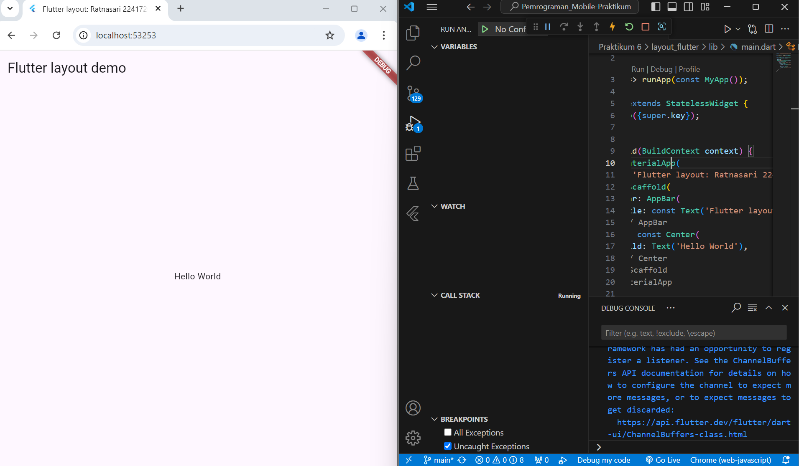
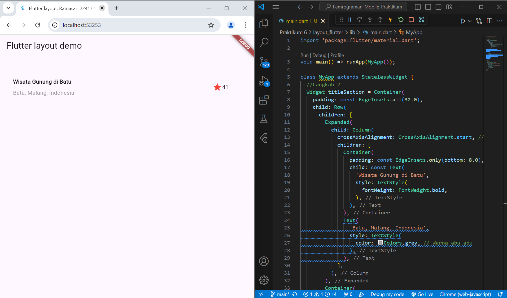
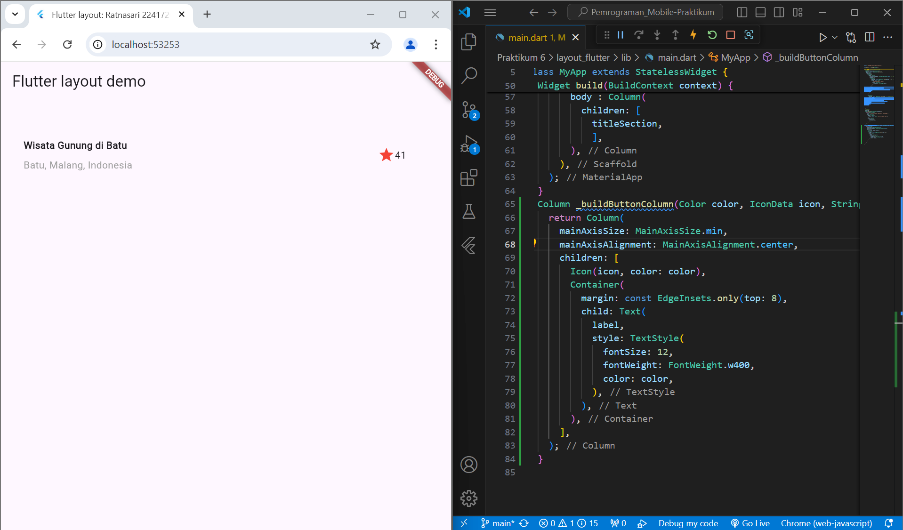
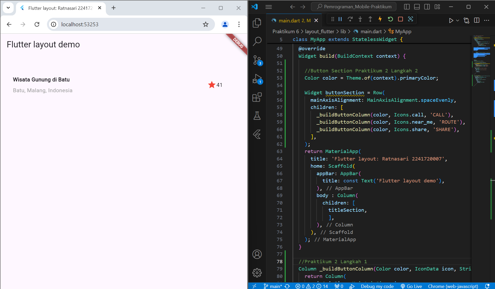
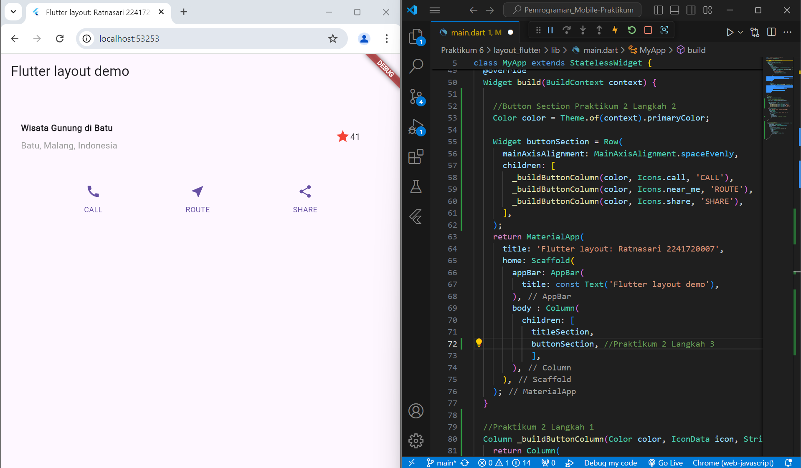
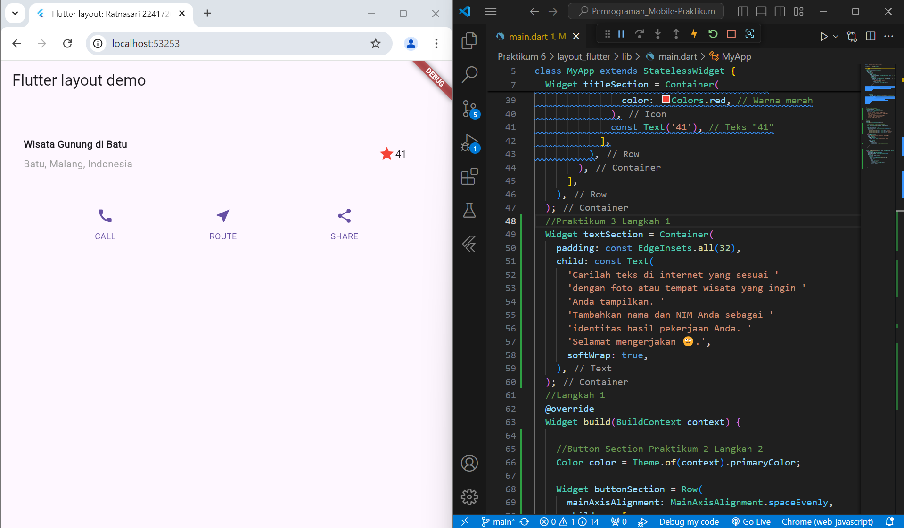
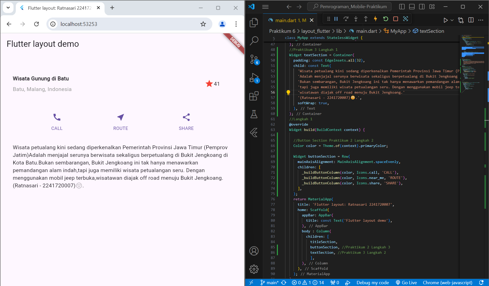
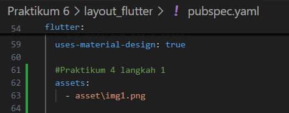
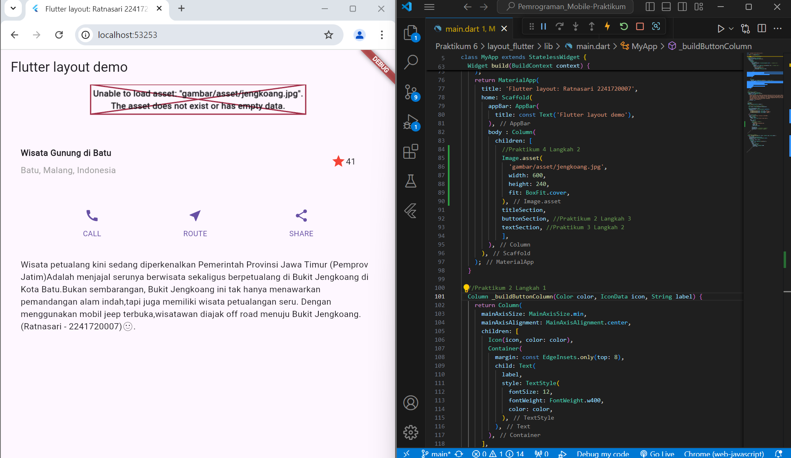
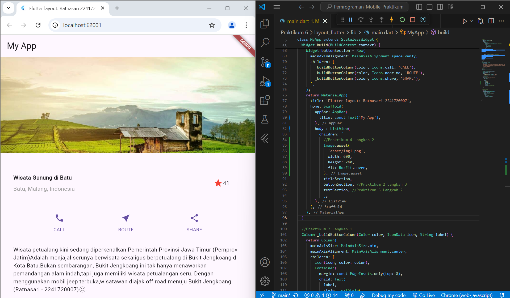

Nama : Ratnasari

NIM : 224172007

# TUGAS 1

## PRAKTIKUM 1 Membangun Layout di Flutter

Selesaikan Praktikum 1 sampai 4, lalu dokumentasikan dan push ke repository Anda berupa screenshot setiap hasil pekerjaan beserta penjelasannya di file README.md!

Silakan implementasikan di project baru "basic_layout_flutter" dengan mengakses sumber ini: https://docs.flutter.dev/codelabs/layout-basics

Kumpulkan link commit repository GitHub Anda kepada dosen yang telah disepakati!


### Langkah 1: Buat Project Baru

### Langkah 2: Buka file lib/main.dart
```dart
import 'package:flutter/material.dart';

void main() => runApp(const MyApp());

class MyApp extends StatelessWidget {
  const MyApp({super.key});

  @override
  Widget build(BuildContext context) {
    return MaterialApp(
      title: 'Flutter layout: Nama dan NIM Anda',
      home: Scaffold(
        appBar: AppBar(
          title: const Text('Flutter layout demo'),
        ),
        body: const Center(
          child: Text('Hello World'),
        ),
      ),
    );
  }
}
```
Hasil


### Langkah 3: Identifikasi layout diagram
Langkah pertama adalah memecah tata letak menjadi elemen dasarnya:

Identifikasi baris dan kolom.
Apakah tata letaknya menyertakan kisi-kisi (grid)?
Apakah ada elemen yang tumpang tindih?
Apakah UI memerlukan tab?
Perhatikan area yang memerlukan alignment, padding, atau borders.

### Langkah 4: Implementasi title row
```dart
Widget titleSection = Container(
    padding: const EdgeInsets.all(32.0),
    child: Row(
      children: [
        Expanded(
          child: Column(
            crossAxisAlignment: CrossAxisAlignment.start, // Jawaban soal 1
            children: [
              Container(
                padding: const EdgeInsets.only(bottom: 8.0), // Jawaban soal 2
                child: const Text(
                  'Wisata Gunung di Batu',
                  style: TextStyle(
                    fontWeight: FontWeight.bold,
                  ),
                ),
              ),
              Text(
                'Batu, Malang, Indonesia',
                style: TextStyle(
                  color: Colors.grey, // Warna abu-abu
                ),
              ),
            ],
          ),
        ),
        Container(
          padding: const EdgeInsets.all(32.0), // Jawaban soal 3
          child: Row(
            children: [
              Icon(
                Icons.star, // Ikon bintang
                color: Colors.red, // Warna merah
              ),
              const Text('41'), // Teks "41"
            ],
          ),
        ),
      ],
    ),
  );
```
pada container
```dart
return MaterialApp(
      title: 'Flutter layout: Ratnasari 2241720007',
      home: Scaffold(
        appBar: AppBar(
          title: const Text('My App'),
        ),
        body : column(
          children: [
            titleSection,
            ],
        ),
      ),
    );
```
Hasil



## PRAKTIKUM 2: Implementasi button row
### Langkah 1: Buat method Column _buildButtonColumn
```dart
class MyApp extends StatelessWidget {
  const MyApp({super.key});

  @override
  Widget build(BuildContext context) {
    // ···
  }

  Column _buildButtonColumn(Color color, IconData icon, String label) {
    return Column(
      mainAxisSize: MainAxisSize.min,
      mainAxisAlignment: MainAxisAlignment.center,
      children: [
        Icon(icon, color: color),
        Container(
          margin: const EdgeInsets.only(top: 8),
          child: Text(
            label,
            style: TextStyle(
              fontSize: 12,
              fontWeight: FontWeight.w400,
              color: color,
            ),
          ),
        ),
      ],
    );
  }
}
```
Hasil


### Langkah 2: Buat widget buttonSection
```dart
Color color = Theme.of(context).primaryColor;

Widget buttonSection = Row(
  mainAxisAlignment: MainAxisAlignment.spaceEvenly,
  children: [
    _buildButtonColumn(color, Icons.call, 'CALL'),
    _buildButtonColumn(color, Icons.near_me, 'ROUTE'),
    _buildButtonColumn(color, Icons.share, 'SHARE'),
  ],
);
```
Hasil


### Langkah 3: Tambah button section ke body
```dart
return MaterialApp(
      title: 'Flutter layout: Ratnasari 2241720007',
      home: Scaffold(
        appBar: AppBar(
          title: const Text('My App'),
        ),
        body : column(
          children: [
            titleSection,
            buttonSection,
            ],
        ),
      ),
    );
```
Hasil


## Praktikum 3: Implementasi text section
### Langkah 1: Buat widget textSection
```dart
Widget textSection = Container(
  padding: const EdgeInsets.all(32),
  child: const Text(
    'Carilah teks di internet yang sesuai '
    'dengan foto atau tempat wisata yang ingin '
    'Anda tampilkan. '
    'Tambahkan nama dan NIM Anda sebagai '
    'identitas hasil pekerjaan Anda. '
    'Selamat mengerjakan 🙂.',
    softWrap: true,
  ),
);
```
Hasil

### Langkah 2: Tambahkan variabel text section ke body
```dart
return MaterialApp(
      title: 'Flutter layout: Ratnasari 2241720007',
      home: Scaffold(
        appBar: AppBar(
          title: const Text('My App'),
        ),
        body : Column(
          children: [
            titleSection,
            buttonSection,
            textSection,
            ],
        ),
      ),
    );
```
Hasil


## Praktikum 4: Implementasi image section
### Langkah 1: Siapkan aset gambar

### Langkah 2: Tambahkan gambar ke body
```dart
return MaterialApp(
      title: 'Flutter layout: Ratnasari 2241720007',
      home: Scaffold(
        appBar: AppBar(
          title: const Text('My App'),
        ),
        body : Column(
          children: [
            //Praktikum 4 Langkah 2
            Image.asset(
              'asset/img1.png',
              width: 600,
              height: 240,
              fit: BoxFit.cover,
            ),
            titleSection,
            buttonSection, //Praktikum 2 Langkah 3
            textSection, //Praktikum 3 Langkah 2
            ],
        ),
      ),
    );
```
Hasil

### Langkah 3: Terakhir, ubah menjadi ListView
```dart
return MaterialApp(
      title: 'Flutter layout: Ratnasari 2241720007',
      home: Scaffold(
        appBar: AppBar(
          title: const Text('My App'),
        ),
        body : ListView(
          children: [
            //Praktikum 4 Langkah 2
            Image.asset(
              'asset/img1.png',
              width: 600,
              height: 240,
              fit: BoxFit.cover,
            ),
            titleSection,
            buttonSection, //Praktikum 2 Langkah 3
            textSection, //Praktikum 3 Langkah 2
            ],
        ),
      ),
    );
```
Hasil
