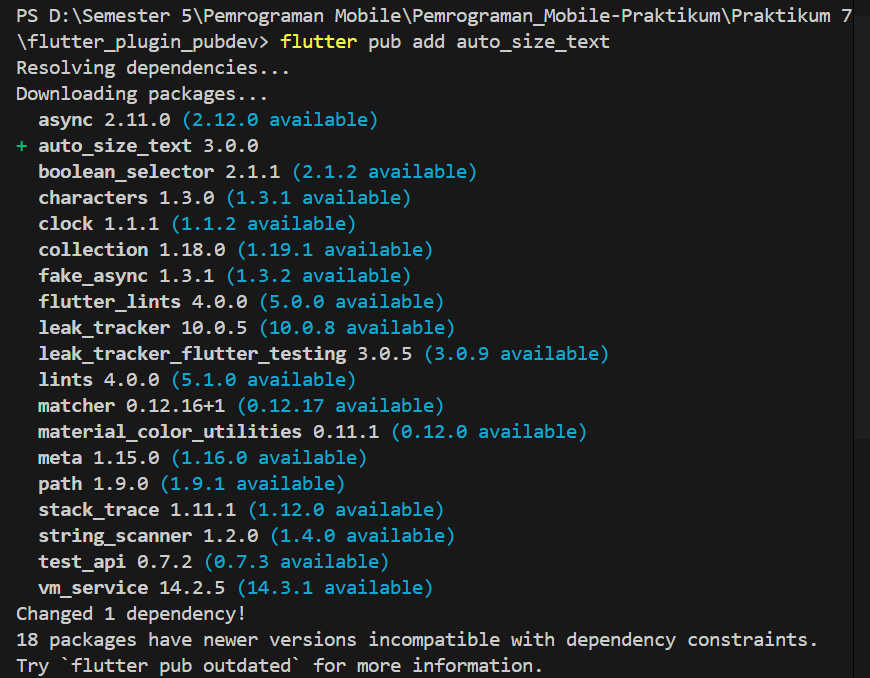
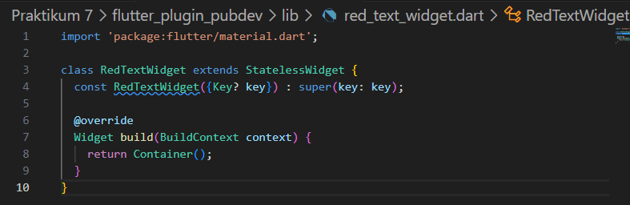
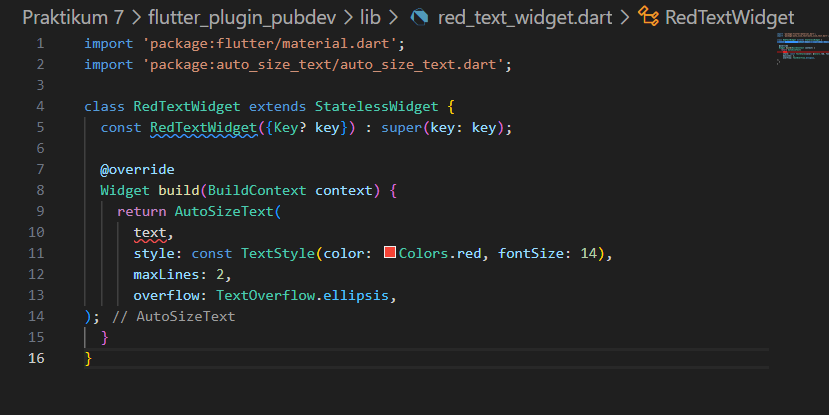
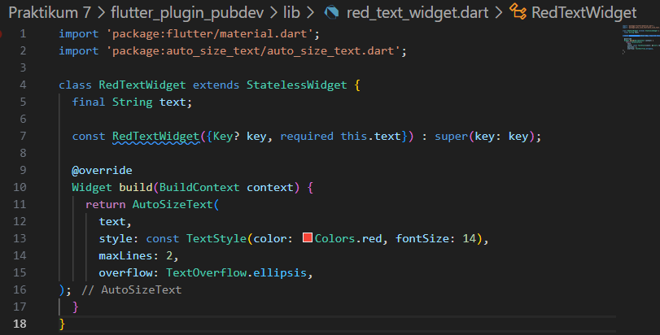
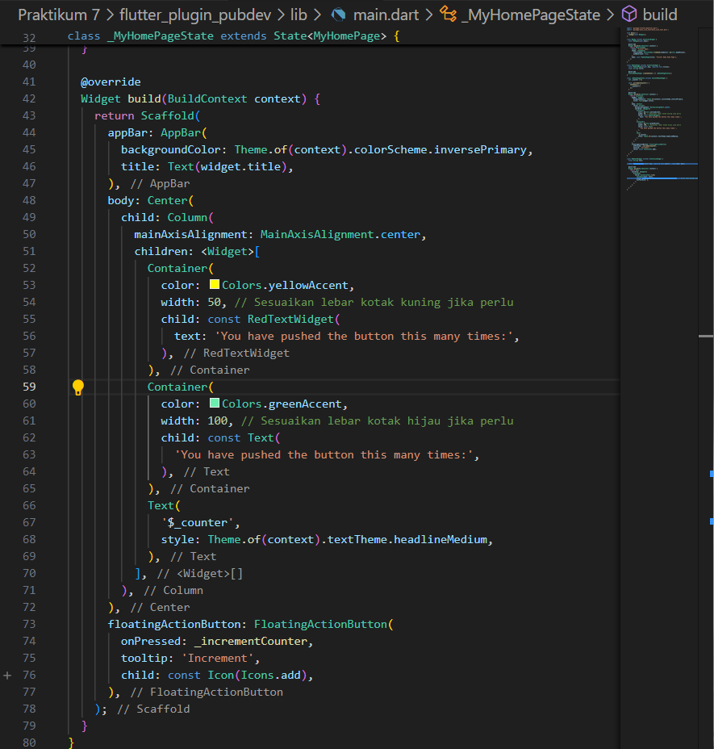
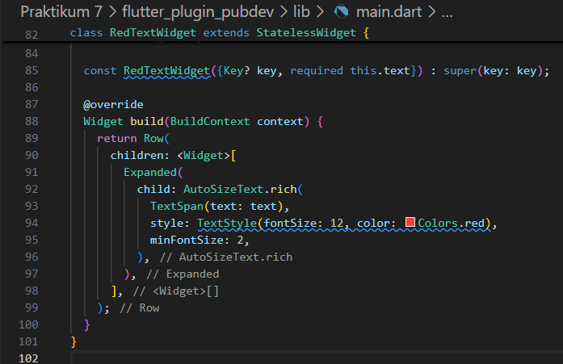
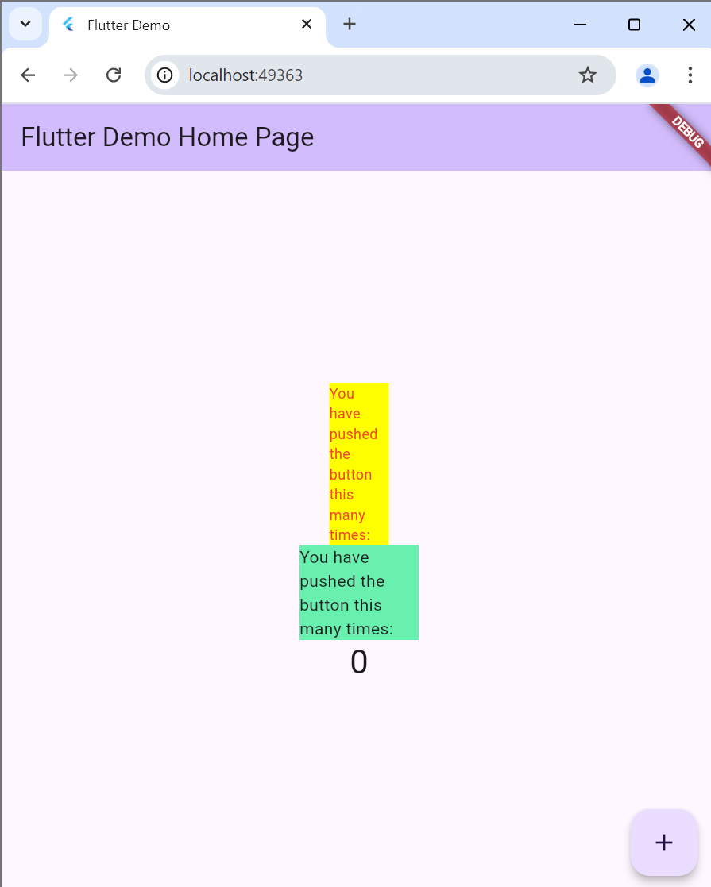
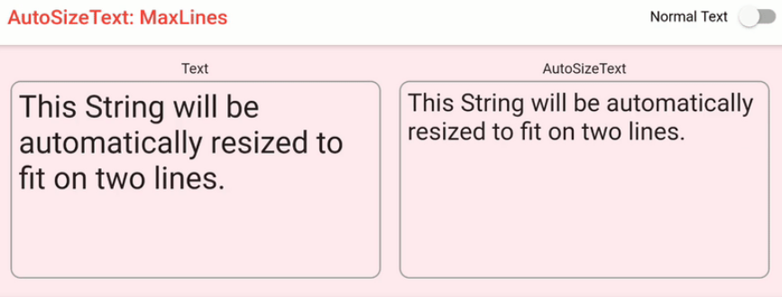

Nama : Ratnasari

NIM : 2241720007

Kelas : TI 3D

# PRAKTIKUM 7
Menerapkan Plugin di Project Flutter

## Langkah 1: Buat Project Baru

## Langkah 2: Menambahkan Plugin
Tambahkan plugin auto_size_text menggunakan perintah berikut di terminal

## Langkah 3: Buat file red_text_widget.dart
Buat file baru bernama red_text_widget.dart di dalam folder lib lalu isi kode seperti berikut.

## Langkah 4: Tambah Widget AutoSizeText
Masih di file red_text_widget.dart, untuk menggunakan plugin auto_size_text, ubahlah kode return Container() menjadi seperti berikut.

## Langkah 5: Buat Variabel text dan parameter di constructor
Tambahkan variabel text dan parameter di constructor seperti berikut.

## Langkah 6: Tambahkan widget di main.dart
Buka file main.dart lalu tambahkan di dalam children: pada class _MyHomePageState

## Hasil Praktikum 7

# Tugas Praktikum
1. Selesaikan Praktikum tersebut, lalu dokumentasikan dan push ke repository Anda berupa screenshot hasil pekerjaan beserta penjelasannya di file README.md!
2. Jelaskan maksud dari langkah 2 pada praktikum tersebut!

Jawaban :

 jadi fungsi kode tersebut ialah untuk menambahkan plugin auto_size_text yang berguna untuk menyesuaikan ukuran teks secara otomatis agar sesuai dengan ruang yang tersedia. 

3. Jelaskan maksud dari langkah 5 pada praktikum tersebut!

Jawaban :

berguna untuk menambahkan variabel text ke dalam widget RedTextWidget sebagai parameter agar widget tersebut bisa menerima teks dari luar. Dengan mendefinisikan final String text; dan menambahkannya sebagai parameter di constructor const RedTextWidget({Key? key, required this.text}) : super(key: key);, memungkinkan untuk mengirim nilai text saat membuat instance RedTextWidget, sehingga teks bisa disesuaikan sesuai kebutuhan.

4. Pada langkah 6 terdapat dua widget yang ditambahkan, jelaskan fungsi dan perbedaannya!

Jawaban :

dua widget Container ditambahkan dengan tujuan menampilkan teks yang berbeda. 
- Widget pertama adalah RedTextWidget yang menggunakan plugin auto_size_text untuk membuat teks otomatis menyesuaikan ukuran lebar kontainer kuning berukuran 50 piksel, sehingga teks tidak terpotong dan tetap terbaca dengan jelas. Di dalamnya, AutoSizeText memungkinkan teks menyesuaikan ukuran font secara otomatis berdasarkan ruang yang tersedia. 
- Widget kedua adalah Text biasa, ditampilkan dalam kontainer hijau berukuran 100 piksel. Karena menggunakan Text standar tanpa auto_size_text, teks ini tidak menyesuaikan ukuran font secara otomatis dan dapat terpotong jika ruangnya terbatas.

5. Jelaskan maksud dari tiap parameter yang ada di dalam plugin auto_size_text berdasarkan tautan pada dokumentasi ini !

Jawaban :

jadi maksudnya ialan untuk membuat tulisan menjadi penuh dengan ukuran container yang tersedia.

6. Kumpulkan laporan praktikum Anda berupa link repository GitHub kepada dosen!